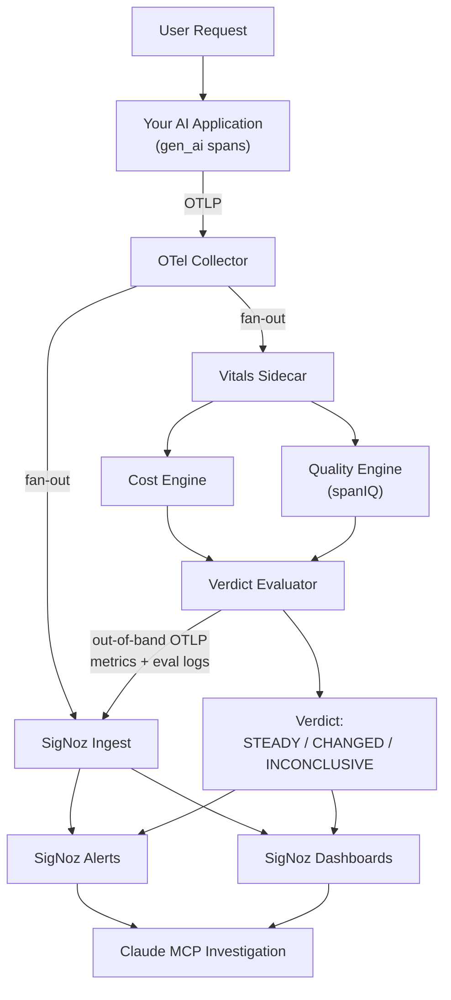

# Vitals

**The missing vital signs for AI systems: cost and quality, as first-class, alertable SigNoz signals.**

Built for the **Agents of SigNoz Hackathon** (WeMakeDevs × SigNoz), Track 1: AI & Agent Observability.

Observability has three signals for machines: traces, metrics, logs. AI systems need two more that no OTel-native platform provides today: **what a response costs right now** and **whether the answer is any good**. Vitals is an OTel-native sidecar that sits next to your existing SigNoz pipeline, scores every `gen_ai` span deterministically and out of the request path, and emits both signals back into SigNoz as native metrics, dashboards, and alerts.

---

## The Problem

A dashboard full of green latency and error-rate panels tells you almost nothing about an LLM feature.

- **A wrong answer is still a `200 OK`.** Nothing in traces/metrics/logs distinguishes a great response from a confidently bad one; there's no exception, no non-2xx status, no signal at all.
- **Silent regressions are the norm, not the edge case.** In April 2026, Anthropic confirmed that Claude Code quality complaints were caused by a product-layer prompt/reasoning change: no model version change, no notification, and no way to detect it without measuring outputs. Anthropic's own engineers found out from user complaints. If the model vendor can't catch this internally, an app team building on top of it has even less visibility.
- **Cost failures are just as silent, and much more expensive per hour.** The most-cited public postmortem in this space: four LangChain agents with no step cap recursed for 11 days and produced a $47,000 invoice, with every dashboard green the entire time. The failure mode isn't total spend, it's *spend rate*; a runaway loop looks like a slightly busier day until the bill arrives.
- **Real evaluation is too slow and too expensive to run on every request.** LLM-as-judge scoring costs cents per call and takes seconds, so teams sample it offline, in a separate tool, disconnected from the alerting system that actually pages someone. Quality data exists; it just never reaches production.

Production teams end up watching p99 latency religiously and finding out about quality or cost problems from a support ticket or an invoice.

---

## Our Solution

Vitals is a small service that turns your existing `gen_ai` OpenTelemetry spans into two alertable SigNoz signal families: **cost velocity** and **quality drift**.

It doesn't replace your observability stack or sit in the request path. Your OTel Collector already emits spans to SigNoz; Vitals asks for a second, fanned-out copy of that same stream. It scores each span in a background process, using **deterministic, reference-free math** (no LLM-as-judge, no per-request API call), and writes the results back to SigNoz over its own out-of-band OTLP connection: metrics for dashboards, and trace-linked log records for per-response drill-down.

Because scoring is deterministic and costs $0 and a few milliseconds per span, Vitals can run on **100% of traffic** instead of a sample, which matters because computing drift requires a real distribution, not a sample of one.

The high-level workflow:

1. Your app emits `gen_ai` spans as usual (OpenTelemetry semantic conventions).
2. Your OTel Collector fans a copy out to Vitals alongside its normal SigNoz path.
3. Vitals scores cost and quality on every span and tracks a rolling per-scope baseline.
4. Every few seconds, an evaluator compares the current window to that baseline and emits a **verdict**, one of `WARMING`, `STEADY`, `CHANGED`, or `INCONCLUSIVE`, as a metric and a log line, back in SigNoz.
5. Dashboards and alert rules built on those signals catch a poisoned deploy or a runaway loop the same way you'd catch a latency spike, because now it's the same kind of signal.
6. From an alert or a dashboard panel, a judge (or an on-call engineer) can hand the investigation to Claude via SigNoz's MCP server and ask it to dig through the underlying traces.

> **Honesty framing:** Vitals' online quality scores measure *deviation from an established good baseline*, not absolute correctness. It answers "did quality change, when, and with which release," the question behind every silent-regression incident above, not "is this answer true." See [docs/honesty.md](docs/honesty.md).

---

## Key Features

- **Automatic AI behavior-change detection**: deterministic drift scoring (PSI vs. a frozen healthy baseline) plus calibrated onset detection, with zero LLM-judge calls
- **Runaway-cost detection**: per-service/model/version spend *velocity* (USD/min), so a loop pages you in minutes, not on the invoice
- **Built on OpenTelemetry**: consumes standard `gen_ai` semantic-convention spans; proposes a matching `gen_ai.evaluation.*` convention for eval results ([docs/conventions.md](docs/conventions.md))
- **Native SigNoz dashboards and alerts**: three importable dashboards, one importable alert rule, verified against a live SigNoz instance
- **Verdict-based alerting with built-in guardrails**: suppresses false positives from low sample counts and from traffic-topic shifts that aren't actually model regressions
- **Deterministic replay demo**: every scenario reproduces offline from recorded fixtures, no API keys or network calls required
- **Claude MCP integration**: SigNoz's MCP server exposes the resulting dashboards to Claude Code for agentic investigation of a verdict

---

## Architecture



- **Your AI Application**: any service emitting OTel `gen_ai` semantic-convention spans (the demo ships a Groq-backed RAG app as a reference).
- **OTel Collector**: the piece you likely already run. It fans a second, unmodified copy of the same span stream out to Vitals; it does not need to know Vitals exists.
- **Vitals Sidecar** (`vitals/`): an OTLP/gRPC receiver, a cost engine, and a quality engine, all in one process. Never in the request path: nothing user-facing waits on it, and if it goes down, your SigNoz pipeline is unaffected.
- **Verdict Evaluator**: ticks on an interval, compares each service/model/version scope's current window against its healthy baseline, and emits a state (`WARMING`, `STEADY`, `CHANGED`, `INCONCLUSIVE`) with sigma-scored evidence and human-readable falsifier statements.
- **SigNoz**: receives Vitals' metrics and eval logs over its own out-of-band OTLP connection (not through the monitored collector), alongside your normal traces/metrics/logs.
- **Dashboards & Alerts**: three importable SigNoz dashboards (Overview, Release Compare, Drift) and an alert rule for verdict transitions, all in `assets/`.
- **Claude MCP Investigation**: SigNoz's MCP server (deployed alongside SigNoz via Foundry) lets Claude Code query the same dashboards to investigate a `CHANGED` verdict agentically.

---

## How Detection Works

1. **Healthy baseline.** For each service/model/version combination, Vitals collects a rolling window of responses (default: 30) before it will emit any score. Before that, the state is `WARMING`: no score, ever, until there's enough data to trust one.
2. **Continuous evaluation.** Every response after that is compared against the baseline using deterministic statistics, no per-request LLM call, so this runs on every single span, not a sample.
3. **Production metrics.** The same loop tracks cost per request and spend velocity (USD/min) per scope, so cost and quality are evaluated on the same cadence.
4. **Verdicts.** A background evaluator periodically turns the comparison into one of four states, `WARMING`, `STEADY`, `CHANGED`, or `INCONCLUSIVE`, with guardrails that catch two common false-positive sources: too little traffic to trust yet, and a shift in what users are asking rather than in how the model is answering. `CHANGED` verdicts try to attribute the cause to a recent release when the timing lines up.

No mathematical detail here on purpose; see [docs/architecture.md](docs/architecture.md) and [docs/blind-spots.md](docs/blind-spots.md) for the full statistical treatment and known boundaries.

---

## Demo Scenario

Every scenario in Vitals is reproducible two ways: instantly via a deterministic replay engine, or live through the full Docker Compose + SigNoz stack.

**Replay** (`vitals replay <fixture>`) feeds pre-recorded OTLP spans through the real scoring and verdict pipeline, with its own receiver, evaluator, and console. No Groq key, no Docker, no network calls. Four scenarios ship as fixtures:

| Scenario | Fixture | Expected verdict |
|---|---|---|
| Steady baseline | `01_steady_baseline.jsonl` | `STEADY` |
| Release regression (poisoned prompt) | `02_release_regression.jsonl` | `CHANGED` |
| Runaway cost loop | `03_runaway_loop.jsonl` | `CHANGED` · runaway |
| User traffic topic shift | `04_input_shift.jsonl` | `INCONCLUSIVE` · input shift |

The **live** path runs an actual Groq-backed RAG app behind a real OTel Collector and a real SigNoz instance (deployed via Foundry), with scenario scripts that generate steady traffic, deploy a deliberately poisoned prompt version, simulate a runaway agent loop, and shift query topics, so a judge can watch verdicts and dashboard panels update from real traffic, not a canned replay. See [demo/README.md](demo/README.md) for the full run-of-show, including a SigNoz Query Builder walkthrough and a live-log-tail demo that's the fastest way to prove the pipeline is actually alive.

---

## Tech Stack

| Category | Technologies |
|---|---|
| **Backend** | Python 3.10+, FastAPI (demo RAG app), argparse CLI (`vitals` entrypoint) |
| **Observability** | OpenTelemetry SDK, OTLP gRPC/HTTP exporters, `gen_ai` semantic conventions, OTel Collector, SigNoz (self-hosted via Foundry) |
| **Quality math** | spanIQ (vendored, deterministic drift/consistency/stability metrics), NumPy, SciPy, `ruptures` (changepoint detection) |
| **AI / LLM** | Groq (Llama 3.3 70B) for the demo RAG app; Claude Code + SigNoz MCP server for agentic investigation |
| **Storage** | SQLite (`vitals.db`, verdict history); in-memory rolling baselines and cost windows |
| **Deployment** | Docker / Docker Compose, Foundry (SigNoz deployment tooling) |

---

## Project Structure

```
vitals/
├── vitals/                # the sidecar service
│   ├── ingest/             # OTLP receiver + gen_ai semconv mapper
│   ├── cost/                # price table + spend-velocity engine
│   ├── quality/             # baseline + drift/CUSUM scoring engine
│   ├── verdict/              # scope state, evaluator, verdict types
│   ├── emit/                 # out-of-band OTLP emitter (metrics + eval logs)
│   ├── console/               # built-in HTML console (localhost:8787)
│   ├── replay/                 # deterministic fixture replay engine
│   └── main.py                 # `vitals run` / `record` / `replay` CLI
├── spaniq/                 # vendored deterministic LLM eval engine (unmodified)
├── demo/                   # RAG app, scenario scripts, replay fixtures
│   ├── ragapp/               # Groq-backed FastAPI RAG service
│   ├── scenarios/             # traffic/regression/runaway-loop scripts
│   └── fixtures/               # recorded JSONL spans for replay
├── assets/                 # importable SigNoz dashboards + alert rule
├── deploy/signoz/           # Foundry-managed SigNoz deployment
├── docs/                   # architecture, honesty framing, conventions proposal
└── test/                   # pytest suite (61 tests)
```

---

## Running the Project

### Prerequisites

- Python 3.10+
- Docker Desktop (only needed for the live demo path)

### Install

```bash
python -m venv .venv
.venv/Scripts/activate      # Windows; use .venv/bin/activate on macOS/Linux
pip install -e .
```

For the full quality path (embedding-based consistency/stability metrics), add:

```bash
pip install rich sentence-transformers
```

### Run the tests

```bash
pytest -q
```

### Instant replay demo (no Docker, no API keys)

```bash
python -m vitals.main replay demo/fixtures/02_release_regression.jsonl --speed 10.0 --config vitals.demo.yaml
```

Then open the Vitals console at [http://localhost:8787](http://localhost:8787) to watch the verdict update live. Swap the fixture path to run any of the four scenarios listed above.

### Run the sidecar standalone

```bash
vitals run
```

### Live demo stack (Docker + SigNoz)

```bash
cd deploy/signoz && foundryctl cast -f casting.yaml -p ./pours   # deploy SigNoz
cd ../.. && cp demo/.env.example demo/.env                        # add GROQ_API_KEY (optional)
docker compose -f demo/compose.yaml up --build -d                 # app + collector + vitals
python demo/scenarios/steady_traffic.py --rate 2 --count 50       # generate traffic
```

Full walkthrough, including SigNoz signup, dashboard/alert import, and all four scenario scripts, is in [demo/README.md](demo/README.md).

---

## Screenshots


---

## Future Work

- **Persistent baselines across restarts**: baselines and cost windows are in-memory today; spanIQ already ships a SQLite-backed store to wire in.
- **Per-chunk RAG grounding**: score query↔chunk and answer↔chunk relevance, not just end-to-end response drift.
- **Changepoint attribution**: spanIQ's PELT primitives can localize *which* pipeline component drifted, beyond the onset timestamp Vitals reports today.
- **Per-tenant impact dimensions**: surface which customers or segments are affected by a `CHANGED` verdict, not just that one occurred.
- **Upstream the `gen_ai.evaluation.*` convention**: the proposal in [docs/conventions.md](docs/conventions.md) is written for the OTel GenAI SIG; no such convention exists yet.

---

## Why We Built This

We kept running into the same story: a prompt tweak ships, every dashboard stays green, and the team finds out something broke from a support ticket or an invoice, because latency and error rate were never built to see a confidently wrong answer or a slowly accelerating token spend. Vitals exists because that gap sits exactly between what OpenTelemetry already carries and what LLM-eval tools already know how to compute deterministically; nobody had wired the two together as native, alertable SigNoz signals. We think cost and quality belong on the same dashboard as p99, not in a separate tool nobody checks until it's too late.

See [AI_DISCLOSURE.md](AI_DISCLOSURE.md) for AI tool use in building this project.

Apache 2.0.
