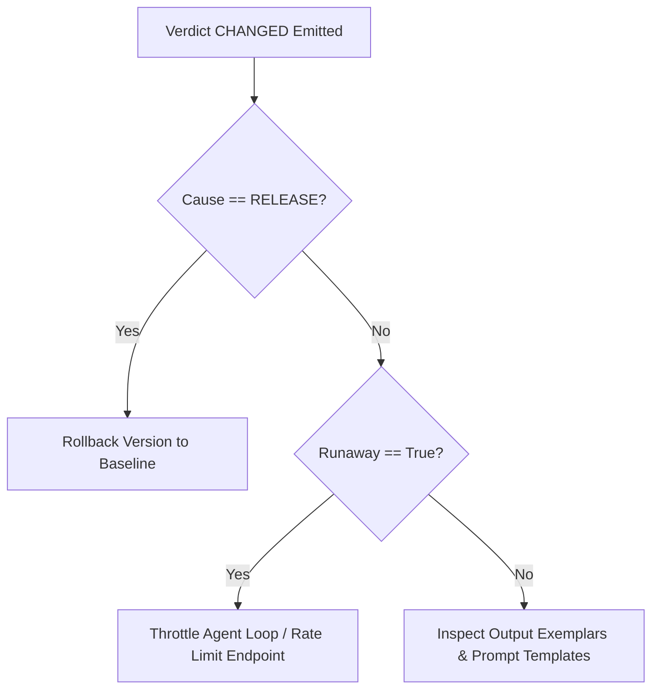

# Vitals Agent Skills Guide

This document defines how AI coding agents and automated remediation workflows consume, interpret, and act upon Vitals Verdicts.

---

## 1. Overview of Vitals Verdicts

Vitals is an AI signal sidecar that continuously monitors GenAI span telemetry (`gen_ai.system`, `gen_ai.request.model`, `service.name`, `service.version`) to deliver deterministic **Verdicts** on AI application health.

Verdicts unify quality drift (ResponseDriftMetric / PSI), spend rate (USD/min velocity), release attribution, and guard checks into a single actionable record.

### Verdict Data Model (`Verdict`)

| Field | Type | Description |
|---|---|---|
| `verdict_id` | `str` | Canonical hex string identifying the verdict record |
| `state` | `VerdictState` | `WARMING` (0), `STEADY` (1), `CHANGED` (2), `INCONCLUSIVE` (3) |
| `subject` | `Subject` | `RELEASE` (version vs version) or `TIME` (current vs lookback) |
| `cause` | `Cause` | `RELEASE` (deploy within 300s of onset) or `UNATTRIBUTED` |
| `behavior_sigma` | `float \| None` | Signed delta in sigma units relative to baseline behavior variance |
| `cost_sigma` | `float \| None` | Signed delta in sigma units relative to baseline cost variance |
| `velocity_ratio` | `float \| None` | Ratio of current USD/min velocity to baseline expected USD/min |
| `runaway` | `bool` | True if cost velocity ratio exceeds 5.0x (overrides hysteresis) |
| `sentence` | `str` | Human-readable canonical verdict sentence |
| `falsifier` | `str` | Explicit metric condition required to transition back to `STEADY` |
| `exemplars` | `tuple[Exemplar]` | Evidence exemplars containing worst and median outputs |

---

## 2. Interpreting Verdict States

### `WARMING` (State 0)
- **Meaning**: Insufficient sample count (collecting reference baseline window).
- **Agent Action**: No action required. Wait for baseline to finish warming.

### `STEADY` (State 1)
- **Meaning**: Monitored signals remain within normal baseline variance (±3σ).
- **Agent Action**: System is healthy. Proceed with planned deployment or monitoring.

### `CHANGED` (State 2)
- **Meaning**: Sustained regression detected in behavior drift (≥3.0σ) or runaway cost spend-rate (≥5.0x).
- **Agent Action**: High priority remediation required. See Section 4.

### `INCONCLUSIVE` (State 3)
- **Meaning**: Detection guard suspended evaluation:
  - `low_sample`: Insufficient samples in current window (`n < min_samples`).
  - `input_shift`: Both input prompt drift and behavior drift shift concurrently (≥3.0σ).
- **Agent Action**: Do **not** trigger a code rollback for `input_shift`. The change is driven by external user query shifts, not model regression.

---

## 3. Parsing Telemetry & Log Records

Vitals emits OTLP log records for each verdict. Trace correlation is natively linked via the worst exemplar's `trace_id` and `span_id`.

### Log Attributes

```json
{
  "service.name": "ragapp",
  "service.version": "v2",
  "gen_ai.system": "openai",
  "gen_ai.request.model": "gpt-4o",
  "vitals.verdict_id": "c0123456789abcde",
  "vitals.state": "changed",
  "vitals.subject": "release",
  "vitals.cause": "release",
  "vitals.behavior_sigma": 4.2,
  "vitals.cost_sigma": 0.3,
  "vitals.velocity_ratio": 1.0,
  "vitals.runaway": false,
  "vitals.falsifier": "would flip to STEADY if behavior drift < 3.0σ (now 4.2σ)",
  "vitals.exemplars": "[{\"kind\":\"worst\",\"trace_id\":\"...\",\"excerpt\":\"...\"}]"
}
```

---

## 4. Remediation Decision Tree

When a `CHANGED` verdict is emitted, agents must follow this decision procedure:



### Action 1: Cause == `RELEASE`
- **Root Cause**: Regression caused by newly deployed release version (e.g. `v2`).
- **Remediation**: Execute immediate version rollback to `baseline_version` (e.g. `v1`).

### Action 2: `runaway == True`
- **Root Cause**: Runaway loop rapidly burning tokens (velocity ratio ≥ 5.0x).
- **Remediation**: Terminate or rate-limit the agent thread loop; enforce max recursion limits.

### Action 3: `INCONCLUSIVE(input_shift)`
- **Root Cause**: User traffic topic shifted (e.g., queries changed from Observability to Database internals).
- **Remediation**: Do not rollback code. If desired, register a separate scope key or update baseline reference.
